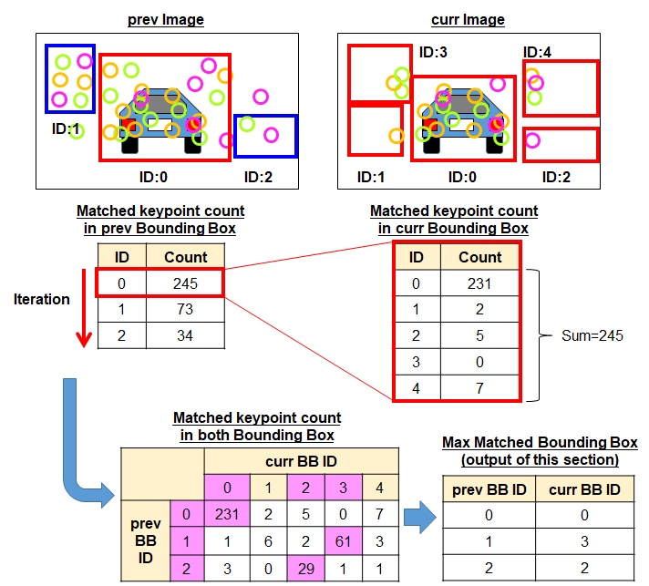
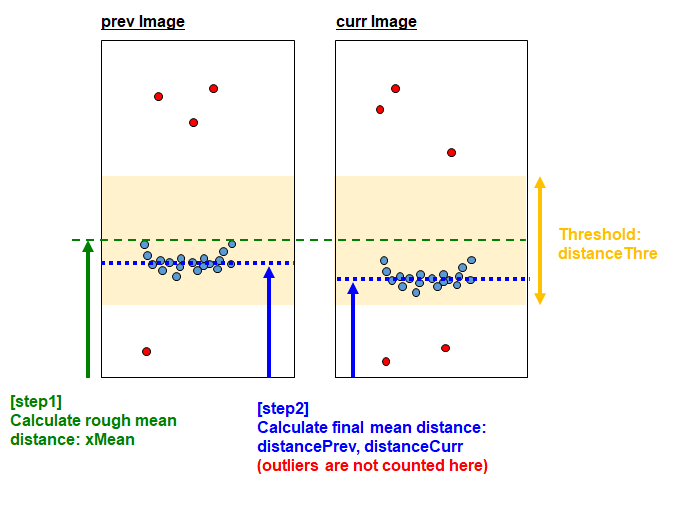
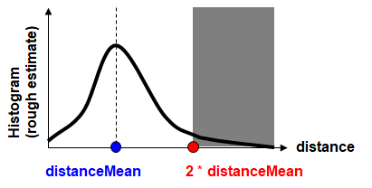
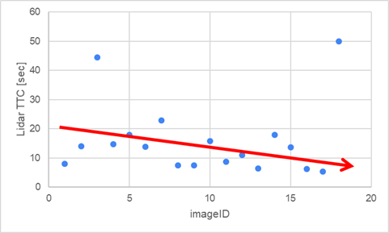
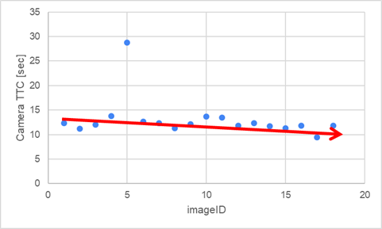
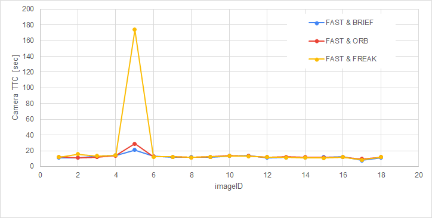

# SFND 3D Object Tracking

## 1. Background
By completing all the lessons, I learned keypoint detectors, descriptors, and methods to match them between successive images. Also, I know how to detect objects in an image using the YOLO deep-learning framework. 
And finally, I know how to associate regions in a camera image with Lidar points in 3D space.
What I have learned in the lessons are contained in the following repository.
https://github.com/kkumazaki/Sensor-Fusion_Camera_Lessons.git

The program schematic shows what I already have accomplished and what's still missing.

## 2. Goal
In this final project, I implemented the missing parts in the schematic. To do this, I completed four major tasks: 
- (1)	I developed a way to match 3D objects over time by using keypoint correspondences.  
- (2) I computed the TTC based on Lidar measurements.  
- (3) I proceeded to do the same using the camera, which requires to first associate keypoint matches to regions of interest and then to compute the TTC based on those matches.  
- (4) I conducted various tests with the framework. My goal is to identify the most suitable detector/descriptor combination for TTC estimation and also to search for problems that can lead to faulty measurements by the camera or Lidar sensor.   

*: In the last course of this Nanodegree, I will learn about the Kalman filter, which is a great way to combine the two independent TTC measurements into an improved version which is much more reliable than a single sensor alone can be.

## 3. Submission
(1) GitHub  
https://github.com/kkumazaki/Sensor-Fusion_Project3_Track-an-Object-in-3D-Space.git

(2) Directory    
I cloned the basic repository from [Udacity](https://github.com/udacity/SFND_3D_Object_Tracking.git) and added/modified the following files.

- [Writeup_of_project3.pdf](Writeup_of_Project3.pdf): Please refer this file for details.
- README.md: Read me file of this repository
- src
  - FinalProject_Camera.cpp: Main script to set the initial conditions and run the functions.
  - camFusion_Student.cpp: Script used to create the functions of Track 3D Object Bounding Boxes and Compute TTC on Object in front.. 
  - matching2D_Student.cpp: Script made in Project 2. (detectors, descriptors and matchers)
- result
  - Project3_result.xlsx: The resulting list of calculating TTC.
  - detector_[ ]_descriptor_[ ].txt: The result of calculation with each combination of detectors/descriptors.

## 4. Result
### *: Please refer to [writeup](Writeup_of_Project3.pdf) for details.
### (1) Match 3D Objects  
### Task FP.1
In this task, I implemented the method "matchBoundingBoxes", which takes as input both the previous and the current data frames and provides as output the ids of the matched regions of interest (i.e. the boxID property). Matches must be the ones with the highest number of keypoint correspondences.  

### (2) Compute Lidar-based TTC
### Task FP.2 : Compute Lidar-based TTC
In this part of the final project, my task is to compute the time-to-collision for all matched 3D objects based on Lidar measurements alone.  I referred to the "Lesson 3: Engineering a Collision Detection System" of this course to revisit the theory behind TTC estimation show as below.  
  
I take 2 steps to calculate the distance to remove outliers as below.  

### (3) Compute Camera-based TTC
### Task FP.3 : Associate Keypoint Correspondences with Bounding Boxes
Before a TTC estimation of Camera, I need to find all keypoint matches that belong to each 3D object. 
I can do this by simply checking whether the corresponding keypoints are within the region of interest in the camera image. All matches which satisfy this condition should be added to a vector. 
There are outliers among my matches, so I should calculate a robust mean of all the euclidean distances between keypoint matches and then remove those that are too far away from the mean.  
  

### Task FP.4 : Compute Camera-based TTC
Once keypoint matches have been added to the bounding boxes, the next step is to compute the TTC estimate. I refer Lesson 3 "compute_ttc_camera.cpp" and use the code sample there as a starting point for this task here. 
Camera TTC is shown below.  
  

### (4) Performance Evaluation
### Task FP.5 : Performance Evaluation 1
This exercise is about conducting tests with the final project code, especially with regard to the Lidar part. 
Look for several examples where I have the impression that the Lidar-based TTC estimate is way off. 
Once I have found those, describe my observations and provide a sound argumentation why I think this happened.   
  

### Task FP.6 : Performance Evaluation 2
### (1)Basic result and analysis of Camera TTC
This last exercise is about running the different detector / descriptor combinations and looking at the differences in TTC estimation. Find out which methods perform best and also include several examples where camera-based TTC estimation is way off. As with Lidar, I describe my observations again and also look into potential reasons. This is the last task in the final project.  
 

### (2)Compare Camera TTC with different kinds of combinations
The task is complete once all detector / descriptor combinations implemented in previous chapters have been compared with regard to the TTC estimate on a frame-by-frame basis. To facilitate the comparison, a spreadsheet and graph should be used to represent the different TTCs.  

Detector: FAST & descriptor: FREAK has one unstable TTC, so it’s not the best one.
FAST & BRIEF and FAST & ORB are almost same, but FAST & BRIEF is a little better.   
 

### **As a conclusion, “detector: FAST & descriptor: BRIEF” is the best combination in Project3.**

## Dependencies for Running Locally
* cmake >= 2.8
  * All OSes: [click here for installation instructions](https://cmake.org/install/)
* make >= 4.1 (Linux, Mac), 3.81 (Windows)
  * Linux: make is installed by default on most Linux distros
  * Mac: [install Xcode command line tools to get make](https://developer.apple.com/xcode/features/)
  * Windows: [Click here for installation instructions](http://gnuwin32.sourceforge.net/packages/make.htm)
* Git LFS
  * Weight files are handled using [LFS](https://git-lfs.github.com/)
* OpenCV >= 4.1
  * This must be compiled from source using the `-D OPENCV_ENABLE_NONFREE=ON` cmake flag for testing the SIFT and SURF detectors.
  * The OpenCV 4.1.0 source code can be found [here](https://github.com/opencv/opencv/tree/4.1.0)
* gcc/g++ >= 5.4
  * Linux: gcc / g++ is installed by default on most Linux distros
  * Mac: same deal as make - [install Xcode command line tools](https://developer.apple.com/xcode/features/)
  * Windows: recommend using [MinGW](http://www.mingw.org/)

## Basic Build Instructions

1. Clone this repo.
2. Make a build directory in the top level project directory: `mkdir build && cd build`
3. Compile: `cmake .. && make`
4. Run it: `./3D_object_tracking`.
